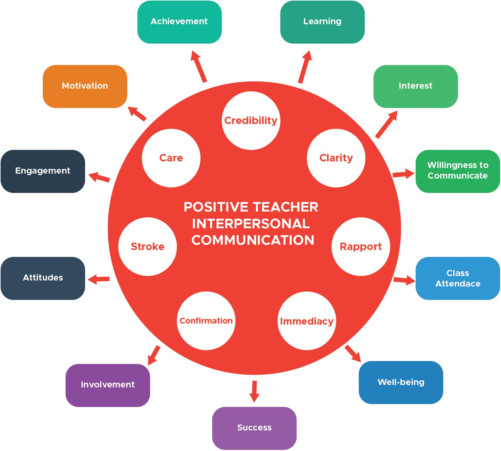

<html>
   <head> 
     E-portfolio
  </head>
  <body>
   <h1>communicational concepts and strategies</h1>
    
   <h2>show confidence and skills in oral communications and presentations</h2>
     
   <h3>work effectively as part of a team</h3>
     
     
   <h4>communicate effectively in a professional context</h4>
       
   <h5>define and demonstrate conflict management and resolution strategies</h5>
     img src=""alt"ko">
   </body>
   </html>
